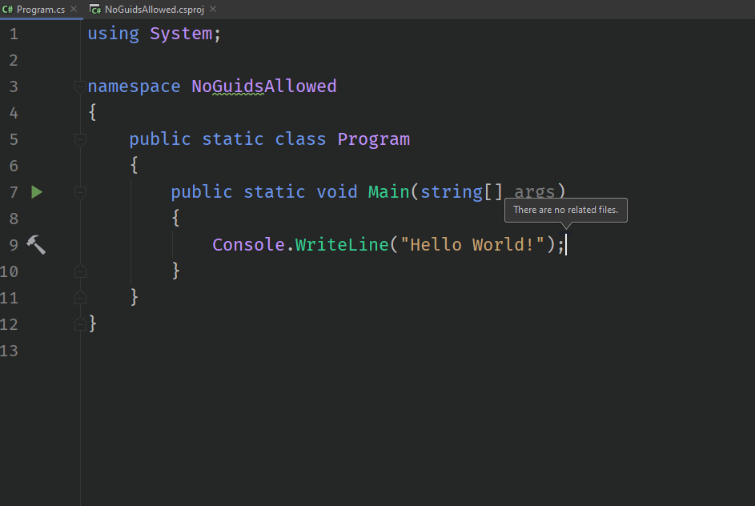

# nodefaultguid-analyzer
A Roslyn Analyzer to prevent using Guid.NewGuid()

## Motive:

I love Roslyn analyzers and I always wanted to learn how to create my own. Recently, I was digging into performance issues caused by using standard `GUID` as primary keys in SQL Server databases (See more here: [combguid-benchmarking](https://github.com/joaopgrassi/combguid-benchmarking)). The TL;DR of it is that using standard GUIDs as your PK/Clustered column causes high database fragmentation. A better approach is then to use what's is known as a [Comb Guid](https://www.informit.com/articles/printerfriendly/25862).

I went on and used a CombGuid implementation in my app all good. But: nothing prevented other developers from still using the standard `Guid.NewGuid()`. So then I thought: This is a perfect place for a Roslyn Analyzer!

## Solution:

The analyzer is pretty simple. It just scans for usages of `Guid.NewGuid()` and generates an error. As I'm still a beginner on this topic, the project it's just the default project template from VS with my try/read/try/error attempts until I got it do to what I wanted :). It's not perfect and there is definitely room for improvements, so PRs are welcome!

## In action

